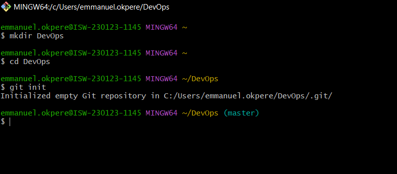
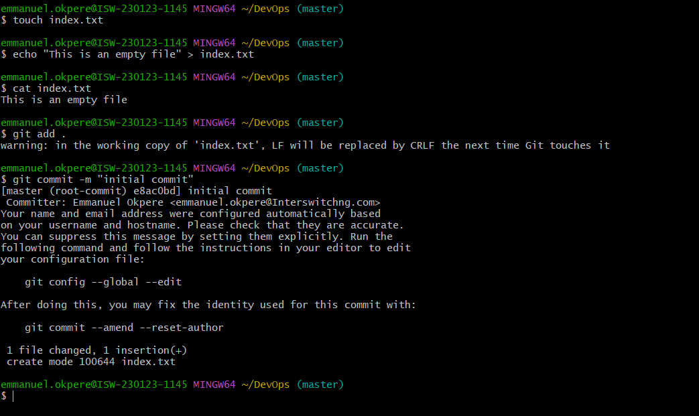
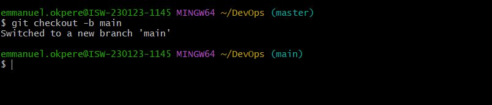
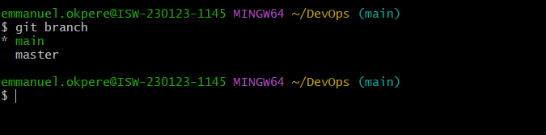
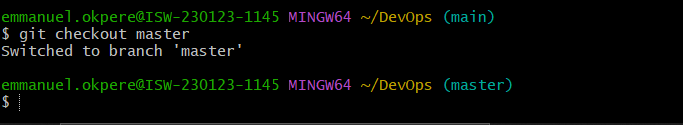
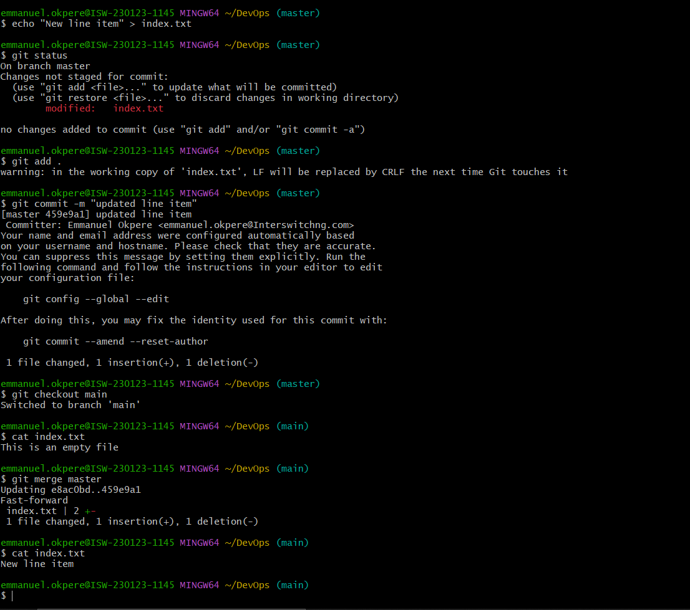
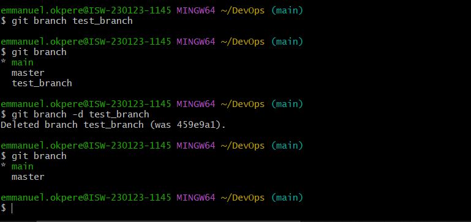
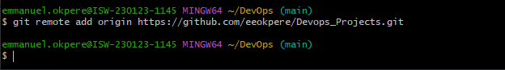
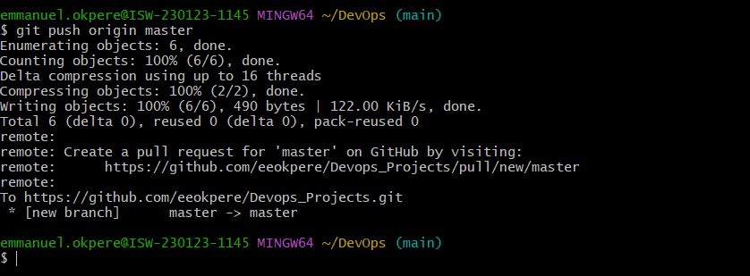
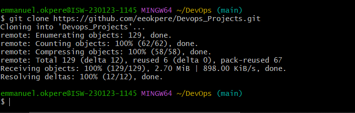

# Initializing a Repository and Making Commits
## Initializing a Repository and Making Commits
Before diving into our main objective which is initializing git and mal<ing commits, lets start by introducing Git.

## What is Git
Git is a distributed version control system. This is a typical definition you will find on the internet. But lets break it down further. Git essentially solves the problem of sharing source code efficiently and keeping track of changes made to source code.
Before Git, there were other technologies available that solves this problem a good example is SVN.

Git adopted a different approach. It allows developers make their own copy of the central repository. That is why it is referred to as a Distributed Version Control System.

### Initializing a Git Repository
Before initializing a git repo you must have installed git in your computer.
Now to initialize a git repo follow these steps:

### Making your first Commit
Commit is more or less saving the changes you made to your files.
Changes can be adding. Modifying or deleting files or text.
Now lets make our first commit by following these steps:

The-mflag is used to provide a commit message. The commit message is a nice way to provide context about the commit. When writing a commit message, make it descriptive as possible. Let it explain why the commit was made.

## Working with Branches
### Working with Branches
Git branch helps you create a different copy(page) of your source code. In your new branch you can make changes as you please. Your change is independent of what is available in the main copy.
Git branch is commonly used to develop new feature of your application. You will agree with me that the initial code is untested and as such can not be added to the code base of your live application.

Git branch is also an important tool for collaboration within remote teams(developers working from different location). They can make separate branches while working on same feature. And at the end of the day, converge their code to one branch.

### Make your first git Branch
To make a new branch run this command: 

The -b flag helps your create and change into the new branch

Listing your git Branches 
Use the command below to list the branches in your local git repository

Change into an old branch
To change an existing old branch, use this command 

Merging a branch into another branch 
If you have multiple Branches, this is how you merge the different contents of the Branches together 

Deleting a git Branch 
Git branch can be deleted with the command below 

## Pushing your Local git Repository to your Remote github Repository.
Having created a github account and a github repository in earlier steps, Lets send a copy of our story to our repository in github.
We will achieve this by following the steps bellow.:
### Add a remote repository to the local repository using the command below:

### After committing your changes to your local repo, you push the content to theremote repo using the command below;

## Cloning Remote Git repository
Best practice dictates that we makes a copy of our story locally in his local machine, creates a branch where we can make all the modifications we sees fit
The command is as follows:

