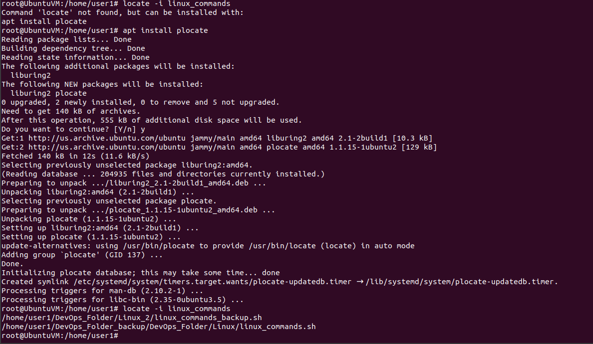
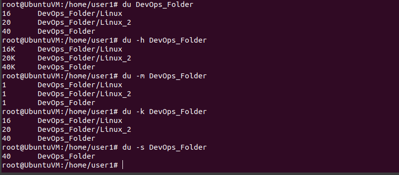
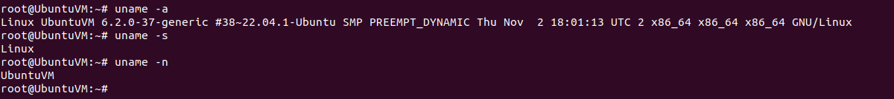

#    LINUX PROJECT INTRODUCTION

## PART 1: RUNNING BASIC COMMAND LINE OPERATIONS

### FILE MANIPULATION
1) sudo COMMAND 
> This command lets you perform tasks that require adminstrative or root permission

2) pwd COMMAND
> This shows the full current working path

 

3) cd COMMAND
> This is used to navigate through images files and directories.

4) ls COMMAND
> This is used to list files and directories in a system

5) cat COMMAND
> cat lists, combines and writes files content to the standard output

6) cp COMMAND
> This is used to copy files or directories and their content

7) mv COMMAND
> This is used to move and rename files or directories

8) mkdir COMMAND
> This is used to create files or directories and set permission for them

9) rmdir COMMAND
> This is used to permanently delete an empty directory

10) rm COMMAND
> This is used to delete files within a directory

11) touch COMMAND
> This command allows you to create an empty file

12) locate COMMAND
> This helps to find files in the database system

13) find COMMAND
> This is used to search for files in a specific directory

14) grep COMMAND
> This helps you find a word by searching all through the texts in a specific file

15) df COMMAND
> This is used to show the systems disk space usage

16) du COMMAND
> This is used to check how much space file takes up

17) head and tail COMMAND
> The head command lets you view the first lines of a text while the tail command lets you view the bottom lines

18) diff COMMAND
> The diff command compares two contents of a file line by line

19) tar COMMAND
> The tar command archives multiple files into a TAR file

## FILE PERMISSION AND OWNERSHIP

20) chmod COMMAND
> This is a commmand that modifies a files read, write and execute permission

21) chown COMMAND
> This command lets you change a files ownership to a specific name

22) jobs COMMAND
> This command shows all the current processes along with their status

23) kill COMMAND
> This command is used to shut down an unresponsive program manually

24) ping COMMAND
> This is used to check whether a network or server is reachable

25) wget COMMAND
> This command is used to download files from the internet

26) uname COMMAND
> This command would show detailed information about your system and hardware

27) top COMMAND
> This command would show all the running processes and a real time view of the current system

28) history COMMAND
> This shows the previous commands used on the system, allowing the user to re use easily

29) man COMMAND
> This provides a user manual of commands that can be run on the terminal

30) echo COMMAND
> This displays a line of tect using the standard output

31) zip/unzip COMMAND
> This lets you compress your files into a zip files while the unzip command allows you to extract it.

32) hostname COMMAND
> This command is run to know the systems hostname

33) useradd/ userdel COMMAND
> This is used to create and delete an account

34) apt-get COMMAND
> This command lets you retrieve information from authenticated sources to manage

35) vi COMMAND
> This allows users to modify files via the text editor

36) alias/unalias COMMAND
> This allows the user to replace one string with another while unalias deletes an alias

37) su COMMAND
> This allows you to run a program as a different user

38) htop COMMAND
> This command is used to monitor system resources and server processes in real time

39) ps COMMAND
> This command provides an overview of all the running processes on the system

